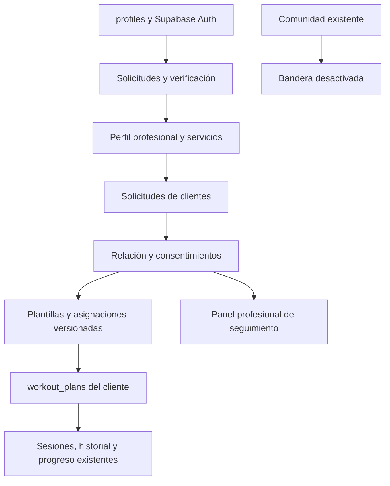

# Módulo de entrenadores y acompañamiento profesional

**Fecha:** 2026-08-07 · **Estado:** Diseño aprobado · **Producto:** Vekira
**Alcance:** MVP sin pagos ni mensajería privada

## 1. Resumen

Vekira incorporará un dominio de entrenadores dentro de la aplicación y la base
de datos actuales. Cualquier usuario podrá solicitar convertirse en entrenador,
pero solo una aprobación administrativa habilitará su perfil público y sus
funciones profesionales. Los clientes podrán descubrir entrenadores verificados,
elegir uno de sus servicios, solicitar acompañamiento y autorizar el acceso a sus
datos de entrenamiento.

Un entrenador activo podrá consultar el progreso consentido del cliente y
asignarle rutinas. La primera rutina requerirá aceptación explícita para
convertirse en el plan principal. Después, el entrenador podrá publicar nuevas
versiones que solo afectarán sesiones futuras. La prescripción permanecerá
bloqueada para el cliente: podrá ejecutarla y registrar resultados reales, pero
no modificar ejercicios, objetivos, orden ni programación.

Comunidad quedará desactivada mediante una bandera de funcionalidad. Su código,
tablas y datos se conservarán para una reactivación posterior.

## 2. Contexto del producto existente

Vekira ya proporciona:

- autenticación y perfiles con Supabase;
- administración y suspensión de cuentas;
- una biblioteca de planes con un único plan activo por usuario;
- planes generados, manuales e importados;
- sesiones, series, repeticiones, peso, RPE, notas y omisiones;
- historial y evidencia de progreso;
- RLS, RPC transaccionales y autorización de inicio de sesión;
- perfiles públicos, seguidores, publicaciones y push social;
- navegación móvil y de escritorio compartida.

El nuevo dominio reutilizará autenticación, ejercicios, planes activos, sesiones
e historial. No reutilizará seguidores como relaciones de entrenamiento: seguir
socialmente a una persona no constituye consentimiento para acceder a datos
físicos o de progreso.

## 3. Objetivos

1. Permitir solicitudes abiertas para convertirse en entrenador.
2. Exigir verificación administrativa antes de cualquier exposición pública o
   permiso profesional.
3. Permitir que un entrenador publique varios servicios, gratuitos durante el
   MVP y preparados para precios futuros.
4. Permitir a los clientes buscar entrenadores y solicitar un servicio.
5. Limitar cada cliente a un único entrenador activo.
6. Conceder acceso por relación y consentimiento, no solo por rol.
7. Permitir al entrenador crear, asignar y versionar rutinas.
8. Bloquear la modificación de las rutinas profesionales por parte del cliente.
9. Mantener la ejecución, el registro real y el historial actuales.
10. Revocar el acceso profesional inmediatamente cuando termine o se suspenda
    una relación.
11. Mantener Comunidad disponible en el repositorio, pero inaccesible mientras
    su bandera esté desactivada.

## 4. Fuera del alcance del MVP

- cobros, suscripciones, reembolsos o pasarela de pago;
- exposición pública de precios;
- mensajería privada entrenador-cliente;
- videollamadas integradas;
- reseñas, puntuaciones o rankings;
- varios entrenadores activos para un mismo cliente;
- reanudación automática después de una suspensión administrativa;
- nutrición clínica, diagnóstico o tratamiento médico;
- edición del plan profesional por el cliente o por el coach de IA.

La identidad estable de los servicios y sus campos comerciales opcionales se
contemplarán desde el esquema. La interfaz no mostrará precios ni permitirá
pagos hasta diseñar e integrar la pasarela.

## 5. Arquitectura

El módulo será un dominio independiente integrado en la misma aplicación Next.js
y el mismo Postgres/Supabase.

Las unidades tendrán límites claros:

- **Verificación:** decide si una cuenta puede actuar públicamente como
  entrenador.
- **Directorio y servicios:** expone solo información profesional aprobada.
- **Relaciones y consentimientos:** concede y revoca acceso a un cliente
  concreto.
- **Programación profesional:** mantiene plantillas, asignaciones y versiones.
- **Motor de Vekira:** ejecuta la copia bloqueada que pertenece al cliente.
- **Seguimiento:** proyecta evidencia existente sin otorgar escritura sobre los
  registros históricos del cliente.

## 6. Identidad y verificación profesional

Una cuenta no tendrá un rol mutuamente excluyente `user` o `trainer`. Todos
seguirán siendo usuarios de Vekira y una aprobación añadirá la capacidad de
entrenador. Así, un entrenador podrá utilizar su espacio personal para entrenar.

### 6.1 Solicitud abierta

La solicitud recogerá:

- nombre profesional y fotografía;
- biografía, especialidades y modalidades;
- años o descripción de experiencia;
- certificaciones mediante documento privado o enlace verificable;
- correo de contacto;
- teléfono o WhatsApp opcional;
- medio de contacto preferido;
- zona horaria y disponibilidad para entrevista.

No se exigirán ni almacenarán documentos de identidad gubernamentales en el
MVP. El contacto y las credenciales serán privados para el solicitante y los
administradores autorizados.

### 6.2 Estados

`trainer_applications.status` usará:

- `draft`;
- `submitted`;
- `under_review`;
- `changes_requested`;
- `interview_required`;
- `approved`;
- `rejected`;
- `withdrawn`.

Una entrevista será selectiva. El administrador podrá proponer fecha, añadir un
medio o enlace externo, registrar el resultado y conservar notas internas.

La aprobación creará o activará el perfil profesional. El rechazo conservará la
razón visible para el solicitante. Cambiar datos profesionales sensibles después
de la aprobación podrá requerir una revisión posterior sin eliminar el historial
de decisiones.

## 7. Perfiles y servicios

Solo un `trainer_profile` aprobado y activo aparecerá en `/trainers`.

`trainer_profiles.status` usará `active`, `suspended` e `inactive`. Solo
`active` habilitará descubrimiento, recepción de solicitudes y acceso al espacio
profesional.

El perfil público incluirá:

- nombre, avatar y biografía;
- especialidades;
- experiencia declarada;
- modalidades: online, presencial o híbrida;
- ubicación general cuando corresponda;
- idiomas;
- insignia de verificación;
- servicios activos.

Los datos administrativos, credenciales, notas e información de entrevista no
serán públicos.

Cada entrenador podrá mantener varios `trainer_service_offerings` con nombre,
descripción, modalidad, duración, contenido, cupo y estado. Los identificadores
serán estables para enlazar solicitudes y futuras compras. Los campos de precio,
moneda y periodicidad podrán existir como opcionales, pero no se expondrán ni se
editarán desde la interfaz del MVP. Todos los servicios se contratarán como
`free_preview`.

## 8. Navegación y rutas

La navegación personal sustituirá `Comunidad` por `Entrenadores`:

`Inicio · Plan · Entrenar · Progreso · Entrenadores`

Una persona aprobada tendrá un selector de espacio:

- **Personal:** navegación normal y directorio de entrenadores.
- **Entrenador:** `Resumen · Clientes · Rutinas · Solicitudes · Perfil`.

El selector cambia el contexto de navegación, no la sesión autenticada.

Rutas propuestas:

- `/trainers` y `/trainers/[slug]` para descubrimiento;
- `/coaching` para la relación del cliente, consentimientos y asignaciones;
- `/coach/apply` para solicitar verificación;
- `/coach` para el resumen profesional;
- `/coach/requests` para solicitudes recibidas;
- `/coach/clients` y `/coach/clients/[clientId]` para seguimiento;
- `/coach/programs` para plantillas y asignaciones;
- `/coach/profile` y `/coach/services` para presencia profesional;
- `/admin/trainers` y `/admin/trainers/[applicationId]` para revisión.

Los guards del servidor impedirán abrir rutas profesionales con una solicitud
pendiente, rechazada o suspendida.

## 9. Solicitudes y relaciones de entrenamiento

### 9.1 Solicitud del cliente

El cliente seleccionará un servicio, añadirá un mensaje y confirmará el
consentimiento básico antes de enviar. Una solicitud tendrá los estados:

- `pending`;
- `accepted`;
- `declined`;
- `cancelled`;
- `expired`.

El cliente podrá cancelar una solicitud pendiente. El entrenador podrá aceptar
o rechazar si continúa verificado y el servicio sigue activo. Se impedirán
duplicados equivalentes mediante constraint e idempotencia.

Un cliente sin relación activa podrá mantener varias solicitudes pendientes a
entrenadores distintos. Mientras exista una relación activa podrá seguir
navegando por el directorio, pero no enviar otra solicitud. Una relación
`paused_by_platform` no se considera activa, por lo que el cliente podrá buscar
un reemplazo.

### 9.2 Relación única

Aceptar se realizará con una RPC transaccional que:

1. bloquee el cliente y la solicitud;
2. vuelva a validar al entrenador y el servicio;
3. compruebe que no existe otra relación activa;
4. cree `coaching_relationships` en estado `active`;
5. marque la solicitud como aceptada;
6. cancele las demás solicitudes pendientes del cliente;
7. cree los consentimientos iniciales;
8. genere las notificaciones correspondientes.

Un índice parcial garantizará un único `coaching_relationships.status = active`
por cliente. Un entrenador podrá tener múltiples clientes.

`coaching_relationships.status` usará `active`, `paused_by_platform` y `ended`.
Volver de `paused_by_platform` a `active` exigirá entrenador restablecido,
confirmación explícita del cliente y ausencia de otra relación activa.

### 9.3 Finalización

Cliente o entrenador podrán finalizar. La operación registrará actor, fecha y
motivo opcional, revocará permisos y congelará las asignaciones. El cliente
conservará la última rutina recibida, ejecutable y bloqueada, pero dejará de
recibir revisiones. Después podrá solicitar otro entrenador.

## 10. Consentimiento y datos compartidos

El consentimiento básico permitirá consultar:

- objetivos, nivel, disponibilidad y equipamiento;
- limitaciones de movimiento relevantes;
- plan activo y calendario;
- sesiones realizadas, omitidas o incompletas;
- series, cargas, repeticiones, RPE, duración y notas;
- adherencia y tendencias de progreso.

Las medidas corporales requerirán un permiso separado. Cada consentimiento
guardará alcance, versión del texto, fecha de concesión y fecha de revocación.
Revocar medidas corporales eliminará ese acceso inmediatamente sin terminar la
relación.

El administrador podrá revisar solicitudes profesionales, pero su interfaz no
expondrá por defecto datos físicos, planes o progreso de los clientes.

## 11. Plantillas, asignaciones y versiones

### 11.1 Plantillas del entrenador

Las plantillas profesionales se almacenarán fuera de `workout_plans`, mediante:

- `trainer_program_templates`;
- `trainer_template_workouts`;
- `trainer_template_exercises`.

Esto evita que las reglas actuales de plan activo, propietario y biblioteca
afecten al catálogo profesional. El entrenador podrá editar una plantilla sin
cambiar ninguna rutina ya asignada.

### 11.2 Primera asignación

Asignar creará una instantánea versionada y un `workout_plan` propiedad del
cliente con:

- `source_type = trainer_assigned`;
- entrenador y relación de origen;
- asignación y versión de origen;
- `prescription_locked = true`;
- estado propuesto, todavía no activo.

El cliente revisará la rutina y deberá aceptarla. La aceptación activará el plan
atómicamente y conservará su plan anterior en la biblioteca.

`trainer_plan_assignments.status` usará `proposed`, `active`, `superseded`,
`frozen` y `removed`. La aceptación inicial registrará `accepted_at`; cada
versión conservará su número, autor, fecha y resumen de cambios.

Las rutinas profesionales usarán un cupo independiente del límite de biblioteca
personal. Así, un usuario gratuito podrá conservar su plan anterior cuando
acepte la rutina del entrenador sin obtener cupos ilimitados para crear planes
personales.

### 11.3 Bloqueo de la prescripción

En una rutina profesional bloqueada, el cliente no podrá:

- editar nombre, objetivo o descripción;
- añadir, eliminar, sustituir o reordenar ejercicios;
- cambiar series objetivo, repeticiones, carga prescrita, RPE o descansos;
- modificar días o programación;
- aplicar ajustes del coach de IA;
- regenerar o autoprogresar la prescripción;
- compartir o redistribuir la rutina.

El bloqueo existirá en UI, Server Actions, RPC y base de datos. Ocultar botones
no será el control de seguridad principal.

Durante una sesión el cliente sí podrá:

- registrar las series, cargas, repeticiones y RPE realmente realizados;
- añadir notas;
- omitir un ejercicio con motivo;
- detener la sesión por seguridad.

Las herramientas actuales de sustitución o ejercicios adicionales “solo por hoy”
se deshabilitarán para estas rutinas. `saveSession` no actualizará objetivos del
plan cuando `prescription_locked = true`.

### 11.4 Revisiones posteriores

El entrenador publicará una nueva versión con resumen de cambios. La operación
creará una nueva instantánea, la enlazará a la misma asignación y activará la
versión para sesiones futuras. No requerirá otra aceptación del cliente.

Una sesión autorizada o iniciada conservará la versión y el contexto con los que
comenzó. Ninguna revisión reescribirá entrenamientos terminados, logs o
snapshots. Si la publicación falla, la versión activa anterior seguirá intacta.

## 12. Seguimiento del cliente

El panel profesional mostrará:

- solicitudes pendientes;
- clientes activos y relaciones pausadas;
- entrenamientos prescritos frente a completados;
- sesiones omitidas o incompletas;
- adherencia semanal y tendencias;
- series, cargas, repeticiones, RPE, duración y notas;
- alertas operativas como inactividad reciente o RPE elevado;
- medidas corporales solo si existe consentimiento vigente.

La adherencia se calculará exclusivamente respecto de sesiones prescritas por el
entrenador. No penalizará actividades personales adicionales. El panel será de
lectura sobre evidencia; los cambios de programación ocurrirán publicando una
nueva versión, no editando logs.

## 13. Suspensión administrativa

Suspender un entrenador:

1. ocultará su perfil y servicios;
2. bloqueará el espacio profesional;
3. cambiará relaciones activas a `paused_by_platform`;
4. revocará de inmediato el acceso a datos de clientes;
5. congelará nuevas asignaciones y versiones;
6. notificará a clientes y entrenador.

Los clientes conservarán sus rutinas bloqueadas y podrán finalizar o buscar otro
entrenador. Si el administrador restablece la aprobación, las relaciones no se
reanudarán automáticamente: cada cliente deberá confirmar que desea continuar.
La confirmación fallará si el cliente ya activó una relación con otro entrenador.

## 14. Autorización y seguridad

Las políticas usarán relación y atributos, no solo un rol global. Para acceder a
datos de un cliente deben cumplirse simultáneamente:

- entrenador aprobado y no suspendido;
- relación activa;
- consentimiento vigente para el alcance solicitado;
- operación permitida para ese recurso.

RLS denegará por defecto. Las verificaciones se centralizarán en funciones
estables y testeables. Los claims modificables por el usuario no se usarán para
autorizar. Las operaciones de aceptar relación, activar rutina, publicar versión,
finalizar y suspender serán RPC transaccionales e idempotentes.

Se registrarán eventos de auditoría para:

- decisiones de verificación e entrevistas;
- cambios de estado profesional;
- solicitudes y relaciones;
- concesión o revocación de consentimiento;
- asignaciones, aceptación y publicación de versiones;
- finalización y suspensión.

## 15. Comunidad desactivada y preservada

`COMMUNITY_ENABLED` tendrá valor falso por defecto durante este trabajo.

Cuando esté desactivada:

- no aparecerá `Comunidad` en la navegación;
- `/feed` redirigirá al directorio de entrenadores;
- posts y compositores devolverán no disponible o `notFound`;
- las acciones sociales rechazarán mutaciones desde el servidor;
- desaparecerán botones de compartir sesiones o rutinas;
- no se inicializarán push ni preferencias sociales;
- migraciones, tablas, componentes y datos permanecerán intactos.

El nuevo directorio `/trainers` no reutilizará `/buscar` ni los seguidores como
fuente de permisos profesionales.

## 16. Notificaciones

Se creará una notificación general de producto, independiente de las entidades
sociales. El MVP ofrecerá centro interno y push nativa cuando exista permiso.

Eventos mínimos:

- solicitud profesional enviada, cambios solicitados, entrevista, aprobación,
  rechazo o suspensión;
- solicitud de cliente recibida, aceptada, rechazada o cancelada;
- rutina asignada o revisión publicada;
- relación pausada, reanudable o finalizada;
- consentimiento relevante revocado.

No habrá respuestas ni chat desde las notificaciones. Tampoco habrá correo
automático; el administrador utilizará los datos de contacto privados para
coordinar entrevistas cuando sea necesario.

## 17. Manejo de errores y concurrencia

- Los cambios de estado validarán su transición tanto en servidor como en base
  de datos.
- Los comandos incluirán claves de idempotencia cuando un reintento pueda crear
  duplicados.
- Solo una aceptación concurrente podrá crear la relación activa.
- Una activación fallida dejará el plan anterior activo.
- Una publicación fallida dejará activa la versión anterior.
- Una solicitud dirigida a un entrenador suspendido o servicio inactivo será
  rechazada al confirmar, aunque la pantalla estuviera desactualizada.
- Los errores recuperables conservarán formularios y ofrecerán reintento.
- Los accesos revocados terminarán de forma segura con una respuesta genérica,
  sin filtrar la existencia de recursos ajenos.

## 18. Fases de entrega

### Fase 1: fundaciones

- bandera de Comunidad;
- notificaciones generales;
- tipos de estado y helpers de autorización;
- auditoría base.

### Fase 2: verificación profesional

- solicitud, credenciales e entrevista;
- administración;
- perfil profesional;
- selector Personal/Entrenador.

### Fase 3: descubrimiento y relaciones

- servicios sin precios;
- directorio y perfil público;
- solicitudes, consentimiento y relación única;
- finalización y suspensión.

### Fase 4: programación profesional

- plantillas;
- asignación y aceptación;
- bloqueo completo;
- versionado y compatibilidad con sesiones.

### Fase 5: seguimiento profesional

- clientes y adherencia;
- detalle de evidencia;
- medidas opcionales;
- avisos operativos.

### Fase 6: endurecimiento y piloto

- accesibilidad;
- rendimiento e índices;
- auditoría;
- pruebas E2E y regresión;
- validación con un grupo pequeño de entrenadores.

Cada fase debe desplegar sus políticas y constraints antes de exponer las rutas
que dependen de ellas.

## 19. Estrategia de pruebas

### Base de datos y seguridad

- constraints e índices parciales de relaciones y planes activos;
- matriz RLS con cliente correcto, entrenador correcto, otro entrenador,
  solicitante pendiente y administrador;
- revocación de consentimiento, finalización y suspensión;
- manipulación de IDs y acceso directo a tablas o RPC;
- concurrencia e idempotencia de aceptar, activar y publicar;
- verificación de que claims modificables no conceden permisos.

### Unidad e integración

- máquinas de estado de solicitudes, perfiles, relaciones y asignaciones;
- guards de rutas y espacios de navegación;
- cálculos de adherencia solo sobre sesiones prescritas;
- políticas de cupos de biblioteca personal y profesional;
- bloqueo de todas las acciones de edición y ajuste;
- desactivación de autoprogresión en planes profesionales;
- notificaciones y auditoría por transición.

### E2E

1. usuario solicita ser entrenador, administrador pide corrección y aprueba;
2. cliente descubre, consiente y solicita;
3. entrenador acepta y obtiene acceso limitado;
4. entrenador asigna rutina y cliente la activa;
5. cliente ejecuta y entrenador ve evidencia;
6. entrenador publica una revisión durante y después de una sesión;
7. cliente revoca medidas y luego termina la relación;
8. administrador suspende y se confirma la revocación inmediata;
9. Comunidad permanece inaccesible con la bandera apagada;
10. planes personales, historial y sesiones existentes no sufren regresiones.

## 20. Criterios de aceptación del MVP

- Ningún solicitante no aprobado aparece como entrenador ni accede al espacio
  profesional.
- Ningún entrenador accede a un cliente sin relación activa y consentimiento.
- Un cliente nunca tiene más de un entrenador activo.
- Una rutina profesional aceptada es ejecutable pero no editable ni ajustable.
- Los resultados reales se guardan sin alterar la prescripción.
- Las revisiones solo afectan sesiones futuras y preservan todo el historial.
- Terminar o suspender revoca acceso en la misma operación.
- Las medidas corporales permanecen ocultas sin permiso explícito.
- Los servicios no muestran precios ni permiten pagos.
- Comunidad está oculta e inaccesible sin eliminar código ni datos.
- La experiencia personal existente continúa funcionando.

## 21. Referencias profesionales y técnicas

- [ACE Code of Ethics](https://www.acefitness.org/fitness-certifications/certified-code-of-ethics/): confidencialidad, instrucción segura, límites profesionales y derivación cuando corresponda.
- [Comisión Europea: minimización de datos](https://commission.europa.eu/law/law-topic/data-protection/rules-business-and-organisations/principles-gdpr/how-much-data-can-be-collected_en).
- [Comisión Europea: consentimiento válido y revocable](https://commission.europa.eu/law/law-topic/data-protection/rules-business-and-organisations/legal-grounds-processing-data/grounds-processing/when-consent-valid_en).
- [OWASP Authorization Cheat Sheet](https://cheatsheetseries.owasp.org/cheatsheets/Authorization_Cheat_Sheet.html): mínimo privilegio, denegar por defecto y validar cada petición.
- [Supabase Row Level Security](https://supabase.com/docs/guides/database/postgres/row-level-security).
- [ABC Trainerize: seguimiento de adherencia y cumplimiento](https://help.trainerize.com/hc/en-us/articles/360022256632-Measuring-Client-Engagement-and-Compliance).
- [ABC Trainerize: panel de información del cliente](https://help.trainerize.com/hc/en-us/articles/46648417703956-Using-the-Client-Insights-Dashboard-Early-Access).
